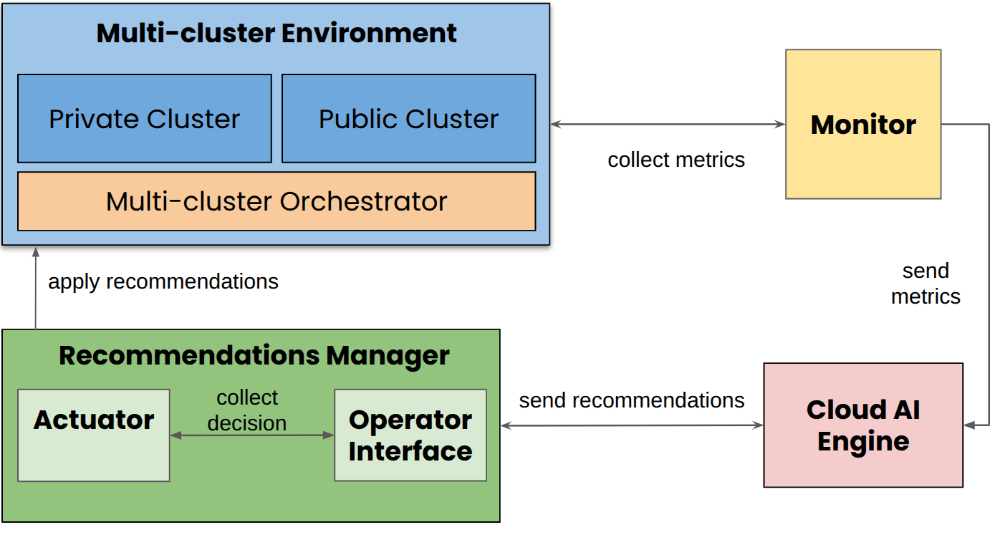

# WASP --- Workload Agent-Based Simulation Platform

**WASP (Workload Agent-Based Simulation Platform)** is a modular
research platform for studying AI-driven workload migration strategies
in hybrid and multi-cluster Kubernetes environments.
It integrates simulation, monitoring, reasoning, validation, and
execution components into a reproducible, containerized environment
designed for:

- Experimentation with AI-assisted workload migration operations
- Reproducible research wrokflows in the area
- Academic experimentation and demonstrations

WASP focuses on **decision-support**, enabling migration recommendations
that can be validated by operators before execution.

------------------------------------------------------------------------

## Overview

WASP provides a controlled experimental environment for evaluating
workload migration strategies under realistic infrastructure
constraints.

### Key Features

-   Multi-cluster Kubernetes simulation (KWOK + Karmada)
-   Telemetry and AI-driven migration recommendations
-   AI-agnostic reasoning engine
-   Human-in-the-Loop (HIL) validation
-   Fully automated execution mode
-   Reproducible experimental runs
-   Containerized microservice architecture

WASP is intended as a **research and evaluation platform**, not a
production orchestration system, as of now.

------------------------------------------------------------------------

## Architecture

WASP implementation is composed of loosely coupled services:

-   **[Simulator](https://github.com/cloud-ai-ufcg/simulator)** --- orchestrates the execution timeline and scheduling.
-   **[Broker](https://github.com/cloud-ai-ufcg/broker)** --- injects workload and infrastructure events. After it starts, the Broker operates independently and is not affected by other components.
-   **[Monitor](https://github.com/cloud-ai-ufcg/monitor)** --- collects telemetry snapshots. The Monitor (yellow box in the diagram) gathers telemetry data from Prometheus, which runs in the simulated clusters.
-   **[AI Engine](https://github.com/cloud-ai-ufcg/ai-engine)** --- generates structured migration recommendations. At regular intervals, the AI Engine (peach box) retrieves the latest telemetry data from the Monitor and produces migration recommendations.
-   **[Recommendations Manager](https://github.com/cloud-ai-ufcg/recommendations-manager)** --- validates and executes approved migrations. The Recommendations Manager (green box) receives recommendations from the AI Engine and, if not in automated mode, validates them through the Operator Interface.
    -   **Actuator** --- executes migration actions. Once recommendations are approved, the Actuator carries out the migration steps.
    -   **Operator Interface (optional)** --- enables human review before execution, allowing operators to approve or reject recommendations when not in automated mode.



------------------------------------------------------------------------

## Requirements

### Hardware

**Minimum:**
-   CPU: 8 cores
-   RAM: 16 GB
-   Disk: 100 GB SSD

**Recommended:**
-   CPU: 12-16 cores
-   RAM: 24-32 GB
-   Disk: 100+ GB NVMe

### Software

Required environment:

-   Ubuntu 22.04.5 LTS
-   GNU Make 4.3
-   Docker 28.3.2
-   Docker Compose 2.36.2 
-   Go 1.24

No preexisting Kubernetes cluster is required. The simulation infrastructure is provisioned automatically.

------------------------------------------------------------------------

## Installation

### 1. Clone Repository and Initialize Submodules

WASP uses Git submodules for its core services, run the following to start them:

``` bash
git clone https://github.com/cloud-ai-ufcg/simulator
cd simulator
git submodule update --init --recursive
```

Failure to initialize submodules will prevent the platform from
starting.

------------------------------------------------------------------------

## LLM Provider Configuration (Required)

The default configuration uses **OpenRouter** as the LLM abstraction
layer.

### Steps

1.  Create an account:

https://openrouter.ai

2.  Generate an API key.

3.  Configure the AI Engine:

``` bash
cd ai-engine
touch .env
```

4. Add the following key to your environment:

    OPENROUTER_API_KEY=your_api_key_here

Alternatively:

``` bash
export OPENROUTER_API_KEY=your_api_key_here
```

> Without a valid API key, the AI Engine will not generate
> recommendations and simulations will fail.

------------------------------------------------------------------------

## Multi-Cluster Infrastructure Configuration

Cluster capacity is defined in:

    simulator/data/config.yaml

Example:

``` yaml
clusters:
  member1:
    nodes: 2
    cpu: "8"
    memory: "16Gi"
    autoscaler: false

  member2:
    nodes: 2
    cpu: "8"
    memory: "16Gi"
    autoscaler: true
```

------------------------------------------------------------------------

## Workload Definition

The simulator is configured to inject a workload defined in `simulator/data/workload.yaml` using the Broker service.
The structured workload definition must follow the schema below:

```json

{
  "config": {
    "orchestrator": "karmada", // Example for Karmada-based infrastructure
    "namespace": "default",
    "kubeconfig": "karmada.config" // kubeconfig used to submit the workload to the orchestrator
  },
  "data": [
    {
      "id": "frontend",
      "kind": "deployment",
      "action": "create",
      "replicas": "2",
      "cpu": "1", // Number of vCPUs (Kubernetes format, e.g., "1" for 1 core or "1000m" for 1 core)
      "memory": "2", // Memory in Kubernetes format (e.g., "2Gi" for 2 GiB, "2048Mi" for 2048 MiB)
      "job_duration": "",
      "label": "member1", // Cluster label for initial placement
      "timestamp": 1
    },
    {
      "id": "finalizer",
      "kind": "deployment",
      "action": "create",
      "replicas": "2",
      "cpu": "1",
      "memory": "2",
      "job_duration": "",
      "label": "member1",
      "timestamp": 10  // Time (in seconds) when the workload is injected into the system
    }
  ]
}

```

> Note: The broker component will submit each event defined in data from the initial timestamp until the last one. It stops after submitting the last event.

------------------------------------------------------------------------

## Quick Start

### Human-in-the-Loop Mode (Recommended for Demonstrations)

``` bash
make
```

Check the Operator Interface is up and running:

    http://localhost:5173

------------------------------------------------------------------------

### Fully Automated Mode

``` bash
make setup-and-start-auto
```

------------------------------------------------------------------------

## Execution Workflow

1.  Multi-cluster infrastructure provisioning
2.  Workload injection via Broker
3.  Telemetry collection (30-second interval)
4.  AI reasoning cycle (60-second interval)
5.  Recommendation validation (HIL or Auto)
6.  Migration execution via Actuator
7.  Metrics and logs persistence

------------------------------------------------------------------------

## Output and Reproducibility

Each execution generates a timestamped output directory (simulator/data/output/) containing:

-   metrics.json
-   logs/
    -   actuator
    -   broker
    -   monitor
    -   ai-engine

------------------------------------------------------------------------

## Makefile Targets

    make
    make setup-and-start-auto
    make setup
    make run-all-containers
    make run-all-containers-auto
    make stop-all-containers
    make restart-all-containers

------------------------------------------------------------------------

## Research Goals

-   Separation of monitoring, reasoning, validation, and execution
-   Model-agnostic AI integration
-   Transparent human-in-the-loop workflows
-   Reproducible simulation environments
-   Operator accountability and auditability

------------------------------------------------------------------------

## Citation (SBRC)

WASP: Workload Agent-Based Simulation Platform

------------------------------------------------------------------------

## License

Copyright 2026 Laboratório de Sistemas Distribuídos (LSD), Universidade Federal de Campina Grande (UFCG) and Hewlett Packard Enterprise Development LP

   Licensed under the Apache License, Version 2.0 (the "License");
   you may not use this file except in compliance with the License.
   You may obtain a copy of the License at

       http://www.apache.org/licenses/LICENSE-2.0

   Unless required by applicable law or agreed to in writing, software
   distributed under the License is distributed on an "AS IS" BASIS,
   WITHOUT WARRANTIES OR CONDITIONS OF ANY KIND, either express or implied.
   See the License for the specific language governing permissions and
   limitations under the License.
