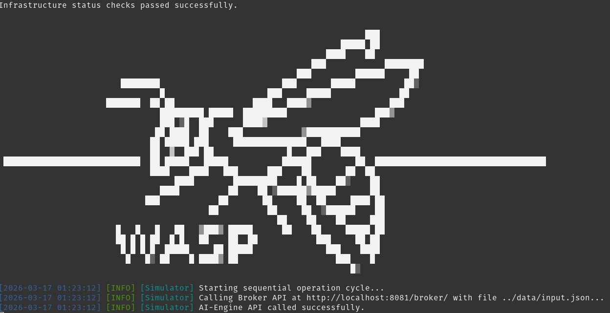
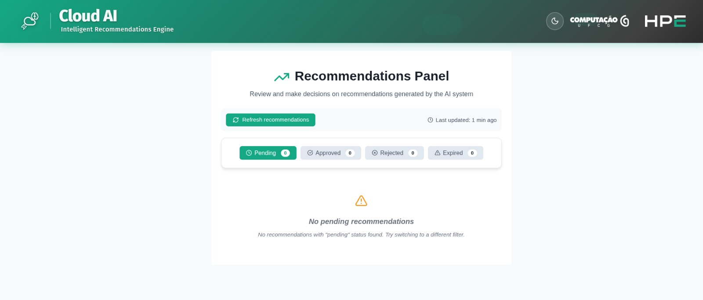
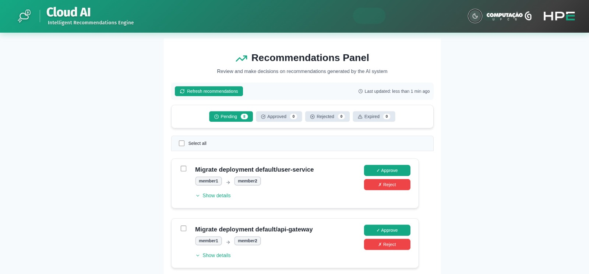

# WASP --- Workload Agent-Based Simulation Platform

**WASP (Workload Agent-Based Simulation Platform)** is a modular
research platform for studying AI-driven workload migration strategies
in hybrid and multi-cluster Kubernetes environments.
It integrates simulation, monitoring, reasoning, validation, and
execution components into a reproducible, containerized environment
designed for:

- Experimentation with AI-assisted workload migration operations
- Reproducible research wrokflows in the area
- Academic experimentation and demonstrations

WASP focuses on **decision-support**, enabling migration recommendations
that can be validated by operators before execution.

## 1. Overview

WASP provides a controlled experimental environment for evaluating
workload migration strategies under realistic infrastructure
constraints.

### 1.1. Key Features

-   Multi-cluster Kubernetes simulation (KWOK + Karmada)
-   Telemetry and AI-driven migration recommendations
-   AI-agnostic reasoning engine
-   Human-in-the-Loop (HIL) validation
-   Fully automated execution mode
-   Reproducible experimental runs
-   Containerized microservice architecture

WASP is intended as a **research and evaluation platform**, not a
production orchestration system, as of now.

### 1.2. Architecture

WASP implementation is composed of loosely coupled services:
-   **[Simulator](https://github.com/cloud-ai-ufcg/simulator)** --- orchestrates execution timeline and scheduling
-   **[Broker](https://github.com/cloud-ai-ufcg/broker)** --- injects workload and infrastructure events
-   **[Monitor](https://github.com/cloud-ai-ufcg/monitor)** --- collects telemetry snapshots
-   **[AI Engine](https://github.com/cloud-ai-ufcg/ai-engine)** --- generates structured migration recommendations
- **[Recommendations Manager](https://github.com/cloud-ai-ufcg/recommendations-manager)** --- validates and executes approved migrations
  -   **Actuator** --- executes migration actions
  -   **Operator Interface (optional)** --- enables human review before execution

Figure 1 below illustrates how the components interact during execution. The Broker operates independently after it starts, and its behavior is not affected by other components. The Monitor collects telemetry data from Prometheus, which runs in the clusters. At regular intervals, the AI Engine retrieves the latest telemetry data from the Monitor and generates migration recommendations. The Recommendations Manager receives these recommendations and, if not in automated mode, validates them through the Operator Interface. Once approved, the Actuator executes the migration actions.


<p align="center"><b>Figure 1:</b> WASP Architecture and component interactions.</p>

## 2. Requirements
Below are the minimum and recommended specifications your machine should meet to run WASP reliably and without performance issues.

### 2.1. Hardware

**Minimum:**
-   CPU: 8 cores; RAM: 16 GB; Disk: 100 GB SSD.

**Recommended:**
-   CPU: 12-16 cores; RAM: 24-32 GB; Disk: 100+ GB NVMe.

### 2.2. Software

Required environment:

-   Ubuntu 22.04.5 LTS
-   GNU Make 4.3
-   Docker 28.3.2
-   Docker Compose 2.36.2 
-   Go 1.24

No preexisting Kubernetes cluster is required. The simulation infrastructure is provisioned automatically.

## 3. Setup and Initial Infrastructure

### 3.1. Clone Repository and Initialize Submodules

WASP uses Git submodules for its core services, run the following to start them:

``` bash
git clone https://github.com/cloud-ai-ufcg/simulator
cd simulator
git submodule update --init --recursive
```

Failure to initialize submodules will prevent the platform from
starting.

### 3.2. AI Engine Configuration

After configuring the LLM provider, you can set up the AI Engine before running the framework by editing the `ai-engine` properties section in `simulator/data/config.yaml`. The engine configuration allows you to define the following behaviors:

* Selected model:

    The model used by the engine to generate recommendations.

    ```yaml
    ai-engine:
      # other properties
      ai:
        selected_model: google/gemini-2.5-flash # default model
      # other properties
    ```
    > Check the models available in your OpenRouter dashboard and update this value if needed.

* Scheduler interval:

    The period of time (in seconds) between each recommendation generation by the engine.

    ```yaml
    ai-engine:
      # other properties
      ai:
        scheduler_interval: 60
      # other properties
    ```

* Graph version:

    The architecture used by the agent for generating recommendations with the selected LLM.

    ```yaml
    ai-engine:
      # other properties
      ai:
        multi_agent: 
          graph_version: v1 # v1 is a single-agent architecture; v2 is a multi-agent architecture
      # other properties
    ```
    > The multi-agent architecture is composed of three agents: performance, cost, and consolidator.

#### 3.2.1. AI Engine Prompts

By default, the engine includes some predefined prompts. However, you can add new prompts by specifying them in the `simulator/data/config.yaml` file and saving them in the `ai-engine/prompts/` directory.

Two kinds of prompts can be used: one for the `v1 architecture` and another for the `v2 architecture`. Both can be configured as follows:

* Setting for `v1 architecture` (single agent):

    ```yaml
    ai-engine:
      # other properties
      ai:
        multi_agent: 
          selected_prompt: multi_agent_v3
      # other properties
    ```

* Setting for `v2 architecture` (multi-agent):

    ```yaml
    ai-engine:
      # other properties
      ai:
        multi_agent: 
          agents:
            prompts:
              performance_prompt_file: performance_agent
              cost_prompt_file: cost_agent
              consolidator_prompt_file: consolidator_agent
      # other properties
    ```

> The prompt names must match the correct file names present in the `ai-engine/prompts/` directory.

#### 3.2.2. LLM Provider Configuration (Required)

The default configuration uses **OpenRouter** as the LLM abstraction
layer.

1.  [Create an OpenRouter account;](https://openrouter.ai)

2.  Generate an API key;
  > OpenRouter offers a free API key with some usage limitations. This allows you to test and run the framework without payment, though higher usage or premium models may require a paid plan.

3.  Configure the AI Engine:

``` bash
cd ai-engine
touch .env
```

4. Add the following key to your environment:

    `OPENROUTER_API_KEY=your_api_key_here`

> Without a valid API key, the AI Engine will not generate
> recommendations and simulations will fail.

### 3.3. Data and Infrastructure

#### 3.3.1. Multi-Cluster Infrastructure Configuration

The cluster specifications are defined in `simulator/data/config.yaml` and must match the following schema:

``` yaml
clusters:
  member1:
    nodes: 2
    cpu: "8"
    memory: "16Gi"
    autoscaler: false

  member2:
    nodes: 2
    cpu: "8"
    memory: "16Gi"
    autoscaler: true
```

> This schema is the default configuration for the quick start scenario.

#### 3.3.2. Workload Definition

The simulator is configured to inject a workload defined in `simulator/data/input.json` using the Broker service.
The structured workload definition must follow the schema below:

```json

{
  "config": {
    "orchestrator": "karmada", // Example for Karmada-based infrastructure
    "namespace": "default",
    "kubeconfig": "karmada.config" // kubeconfig used to submit the workload to the orchestrator
  },
  "data": [
    {
      "id": "frontend",
      "kind": "deployment",
      "action": "create",
      "replicas": "2",
      "cpu": "1", // Number of vCPUs (Kubernetes format, e.g., "1" for 1 core or "1000m" for 1 core)
      "memory": "2", // Memory in Kubernetes format (e.g., "2Gi" for 2 GiB, "2048Mi" for 2048 MiB)
      "job_duration": "",
      "label": "member1", // Cluster label for initial placement
      "timestamp": 1
    },
    {
      "id": "finalizer",
      "kind": "deployment",
      "action": "create",
      "replicas": "2",
      "cpu": "1",
      "memory": "2",
      "job_duration": "",
      "label": "member1",
      "timestamp": 10  // Time (in seconds) when the workload is injected into the system
    }
  ]
}

```

> Note: The broker component will submit each event defined in data from the initial timestamp until the last one. It stops after submitting the last event.

## 4. Quick Start

You can quickly get started by running the following make commands from the root of the WASP repository.

### 4.1. Human-in-the-Loop Mode (Recommended for Demonstrations)

This command will set up the infrastructure locally using Docker, prepare all components for safe execution, and then run a simulation with the default input and configuration. The full setup process may take 10–20 minutes. When it finishes, the screen shown in Figure 2 will appear in the terminal, indicating that the simulation is running. The Operator Interface will be accessible at http://localhost:5173, as shown in Figure 3.

``` bash
make
```


<p align="center"><b>Figure 2:</b> Simulation running.</p>


<p align="center"><b>Figure 3:</b> Operator Interface.</p>

------------------------------------------------------------------------

### 4.2. Fully Automated Mode (Alternative)

The initial flow of this make rule is similar to the previous mode. However, instead of exposing an Operator Interface for human-in-the-loop validation, the Recommendations Manager will automatically apply the AI Engine's recommendations.

``` bash
make setup-and-start-auto
```

## 5. Execution Workflow

During the execution of the framework, you can monitor the components by observing their expected log formats and behaviors, as described below.

### 5.1. Multi-cluster infrastructure provisioning

  After running the infra-environment container, WASP will wait for the Karmada config file to be generated by the infrastructure scripts. During this step, the terminal will display: 
  
  ```bash
  Waiting for Karmada config to be generated...
  ```

### 5.2. Workload injection via Broker

  When running, the Broker submits the workload provided in the input file throughout the simulation period. Below is an example of logs generated by the Broker:

    ```bash
    $ docker logs -f broker

    time=2026-03-17T04:16:54.222Z level=INFO msg="➡️ [1s] [Deployment] CREATE: redis-cache (propagated by Karmada for label 'member1')"
    time=2026-03-17T04:16:54.227Z level=INFO msg="DEBUG: Processing row 5: Kind='deployment', ID='notifications'"
    time=2026-03-17T04:16:54.227Z level=INFO msg="⏳ Waiting 69 seconds"
    time=2026-03-17T04:18:03.270Z level=INFO msg="DEBUG: Matched kind: deployment"
    time=2026-03-17T04:18:03.270Z level=INFO msg="➡️ [70s] [Deployment] CREATE: notifications (propagated by Karmada for label 'member1')"
    time=2026-03-17T04:18:03.273Z level=INFO msg="DEBUG: Processing row 6: Kind='deployment', ID='search-service'"
    time=2026-03-17T04:18:03.273Z level=INFO msg="DEBUG: Matched kind: deployment"
    time=2026-03-17T04:18:03.273Z level=INFO msg="➡️ [70s] [Deployment] CREATE: search-service (propagated by Karmada for label 'member1')"
    time=2026-03-17T04:18:03.276Z level=INFO msg="DEBUG: Processing row 7: Kind='deployment', ID='metrics-exporter'"
    time=2026-03-17T04:18:03.276Z level=INFO msg="DEBUG: Matched kind: deployment"
    ```

### 5.3. Telemetry collection (30-second interval)

  The Monitor logs its collection times as shown below:

    ```bash
    $ docker logs -f monitor

    [GIN] 2026/03/17 - 04:17:57 | 200 |     649.534µs |       127.0.0.1 | GET      "/metrics"
    [GIN] 2026/03/17 - 04:19:02 | 200 |     497.136µs |       127.0.0.1 | GET      "/metrics"
    [GIN] 2026/03/17 - 04:20:06 | 200 |     577.845µs |       127.0.0.1 | GET      "/metrics"
    ```

### 5.4. AI reasoning cycle (60-second interval)

  The following log is an example from the AI Engine, showing a short result generated during a recommendation process.

    ```bash
    $ docker logs -f ai-engine

    [2026-03-17 04:17:57] DEBUG [ai_engine.api] - Fetching metrics from MONITOR: http://0.0.0.0:8082/metrics
    [2026-03-17 04:17:57] INFO [ai_engine.api] - 📊 Successfully fetched metrics from MONITOR
    [2026-03-17 04:17:57] INFO [ai_engine.main] - 🔄 Filtered to 5 unique workloads with non-zero resources 
    from the last 600 seconds
    [2026-03-17 04:17:57] INFO [ai_engine.main] - 🧠 Using openrouter platform for workload analysis
    [2026-03-17 04:17:57] INFO [ai_engine.agents] - CONFIG: Using agent mode: multi_agent
    [2026-03-17 04:17:57] INFO [ai_engine.agents] - CONFIG: Using provider: openrouter
    [2026-03-17 04:17:57] INFO [ai_engine.agents] - CONFIG: Using model: google/gemini-2.5-flash
    [2026-03-17 04:17:57] INFO [ai_engine.agents] - CONFIG: Using generation config: {'temperature': 0.1, 'max_output_tokens': 18000}
    [2026-03-17 04:17:57] INFO [ai_engine.agents] - Using LangGraph v1 (tool_system) for workload recommendations
    [2026-03-17 04:17:57] INFO [ai_engine.cluster_config] - Loaded 2 cluster(s): member1, member2
    [2026-03-17 04:17:57] INFO [ai_engine.langgraph_agents] - Using all clusters for LangGraph prompt (no filter configured)
    [2026-03-17 04:17:57] DEBUG [ai_engine.langgraph_agents] - User prompt for recommendations_node: {"workloads_json":"[\n  {\n    \"workload_id\": \"default/frontend\"",...,"historical_context":""}
    [2026-03-17 04:18:01] INFO [httpx] - HTTP Request: POST https://openrouter.ai/api/v1/chat/completions "HTTP/1.1 200 OK"
    # ...
    [2026-03-17 04:18:02] INFO [ai_engine.api] - ✅ Successfully applied recommendations
    ```
    
### 5.5. Recommendation validation

  In Human-in-the-Loop mode, you can accept or deny the migration of a given workload using the web interface provided by the Recommendations Manager. When a new batch of recommendations arrives in the Operator Interface, they will be listed (after a manual refresh). The Operator Interface provides filters to list pending, approved, rejected, or expired recommendations (the latter are recommendations not decided in a previous batch), as shown below.


<p align="center"><b>Figure 4:</b> Recommendations at Operator Interface.</p>

### 5.6. Migration execution via Actuator

  After approving a migration, the Actuator (a component of the Recommendations Manager) will apply the action to the respective workload.

    ```bash
    $ docker logs -f recommendations-manager
    
    [0] 2026/03/17 05:23:40 🔄 Deployment default/redis-cache updated to member2
    [0] > INFO: 2026/03/17 05:23:40 Successfully applied workload default/redis-cache
    ```

## 6. Output and Reproducibility

Each execution generates a timestamped output directory (simulator/data/output/) containing:

-   metrics.json
-   logs/
    -   actuator
    -   broker
    -   monitor
    -   ai-engine

## 7. Makefile Targets

Makefile Targets:

- `make` or `make all`: Alias for `setup-and-start`. Sets up the infrastructure and runs the simulator in human-in-the-loop mode (with Operator UI). This is the main entry point and will automatically execute the `setup-and-start` target, which itself calls `setup` and then `start`. The simulation will use the workload defined in `simulator/data/input.json` as described in the Workload Definition section above.
- `make setup-and-start-auto`: Sets up the infrastructure and runs the simulator in auto mode (no Operator UI). This target includes all setup steps and starts the simulation with automatic recommendation application, also using the workload from `simulator/data/input.json`.
- `make setup`: Sets up the complete infrastructure (stops/starts Kubernetes and containers). This is called by both `setup-and-start` and `setup-and-start-auto`.
- `make run-all-containers`: Starts all containers in human-in-the-loop mode (with Operator UI). Used internally by `setup`.
- `make run-all-containers-auto`: Starts all containers in auto mode (no Operator UI). Used internally by `setup-and-start-auto`.
- `make stop-all-containers`: Stops and removes all simulator containers, volumes, and images (except infra-environment). Useful for cleanup.
- `make restart-all-containers`: Stops, removes, and recreates all containers, then starts them in human-in-the-loop mode.
- `make start`: Starts only the Go simulator (assumes infrastructure and containers are already running). This target, and any other that calls it, will execute the simulation using the workload defined in `simulator/data/input.json`.
- `make clean-workloads`: Removes all workloads from Karmada and member clusters, but preserves KWOK nodes. Useful for resetting the simulation environment without deleting cluster nodes.
- `make clean-mongo-db`: Removes all documents from all user collections in the MongoDB container. Useful for clearing simulation data between runs.
- `make help`: Shows a help message listing all available make targets and their descriptions.

## 8. Research Goals

-   Separation of monitoring, reasoning, validation, and execution
-   Model-agnostic AI integration
-   Transparent human-in-the-loop workflows
-   Reproducible simulation environments
-   Operator accountability and auditability

## 9. Citation (SBRC)

WASP: Workload Agent-Based Simulation Platform

## 10. License

Copyright 2026 Laboratório de Sistemas Distribuídos (LSD), Universidade Federal de Campina Grande (UFCG) and Hewlett Packard Enterprise Development LP

   Licensed under the Apache License, Version 2.0 (the "License");
   you may not use this file except in compliance with the License.
   You may obtain a copy of the License at

       http://www.apache.org/licenses/LICENSE-2.0

   Unless required by applicable law or agreed to in writing, software
   distributed under the License is distributed on an "AS IS" BASIS,
   WITHOUT WARRANTIES OR CONDITIONS OF ANY KIND, either express or implied.
   See the License for the specific language governing permissions and
   limitations under the License.
