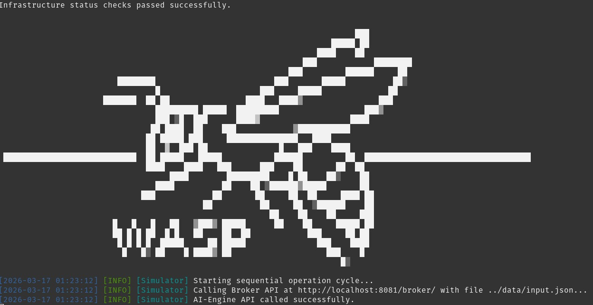
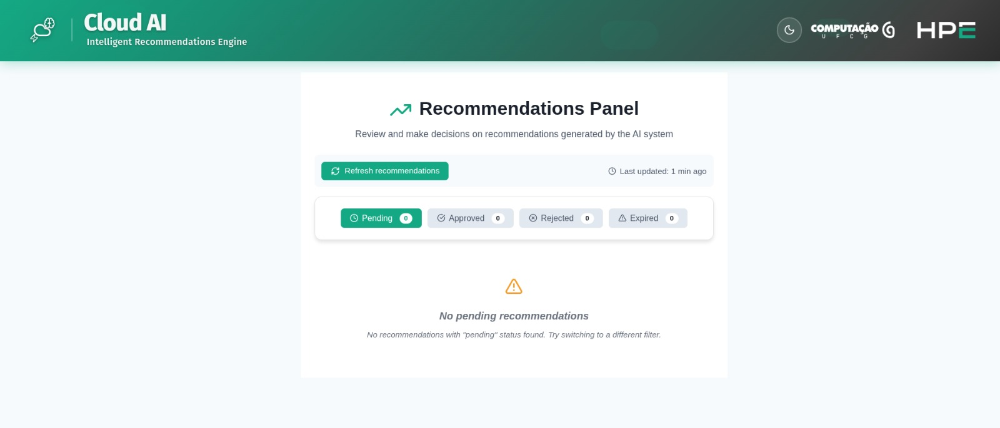

# 1. WASP — Workload Agent-Based Simulation Platform

WASP is a modular research platform for studying AI-driven workload migration strategies in hybrid and multi-cluster Kubernetes environments. The platform integrates simulation, monitoring, reasoning, validation, and execution in a reproducible and containerized environment, focusing on decision support to recommend migrations that can be validated by operators before execution.

**Paper title:** WASP: Workload Agent-Based Simulation Platform for Migration Recommendations in Federated Kubernetes Environments

**Paper abstract:** Workload migration in federated Kubernetes environments is a complex task, as it requires robust strategies that operate under dynamic conditions to balance performance, cost, and availability. Applying these strategies directly in production, especially with unvalidated autonomous agents, can cause performance degradation. This work presents WASP (Workload Agent-Based Simulation Platform), a decision-support tool that enables simulation of agent-based migration strategies before deployment in production. WASP adopts a modular architecture with monitoring, recommendation, and execution-control layers, and supports configurable policies with human-in-the-loop approval.


# 2. Structure of readme.md

This README is organized into the following sections:

1. Project title and artifact summary;
2. Structure of this README;
3. Badges considered in the evaluation;
4. Basic information (architecture, requirements, and environment);
5. Dependencies (software, external services, and configuration files);
6. Security concerns;
7. Installation;
8. Minimal test;
9. Experiments and claim reproduction;
10. License.

In addition, the WASP repository is composed of services structured as submodules, including broker, monitor, ai-engine, and recommendations-manager, as well as infrastructure provisioning scripts and analysis scripts for plot generation.

# 3. Considered badges

The badges considered in the evaluation process are:

- **Artefatos Disponíveis (SeloD)**: code and configurations are publicly available on GitHub, including all submodules;
- **Artefatos Funcionais (SeloF)**: the platform runs end-to-end via a single make command in a local Docker environment, with observable output at each component layer;
- **Artefatos Sustentáveis (SeloS)**: the codebase is modular, with clearly separated services, declarative YAML configuration, and documented component responsibilities;
- **Experimentos Reprodutíveis (SeloR)**: the default configuration reproduces the use case scenario from the paper, with timestamped output logs per component.

# 4. Basic information

## 4.1. Main components

- **Simulator**: orchestrates the simulation timeline and execution flow;
- **Broker**: injects workload and infrastructure events;
- **Monitor**: collects infrastructure telemetry snapshots;
- **AI Engine**: generates structured migration recommendations;
- **Recommendations Manager**: composed of two additional elements, validates and executes approved migrations;
	- **Actuator**: executes migration actions;
	- **Operator Interface** (optional): human validation before execution.

## 4.2. Hardware requirements

**Minimum:**
- CPU: 8 cores
- RAM: 16 GiB
- Disk: 100 GiB SSD

**Recommended:**
- CPU: 12–16 cores
- RAM: 24–32 GiB
- Disk: 100+ GiB NVMe

## 4.3. Software requirements

The versions listed below are those used during development and testing. Compatibility with earlier minor versions has not been verified; using these exact versions is recommended for reproducibility.

- Ubuntu 22.04.5 LTS
- GNU Make 4.3
- Docker 28.3.2
- Docker Compose 2.36.2
- Go 1.24
- R ≥ 4.3 with packages: `ggplot2`, `dplyr`, `readr`, `tidyr` (required for plot generation)

No pre-existing Kubernetes cluster is required. The simulation infrastructure is provisioned automatically.

# 5. Dependencies

## 5.1. Software and service dependencies

Git submodules for WASP core services (broker, monitor, ai-engine, recommendations-manager);
LLM provider for recommendation generation (by default, OpenRouter);
API key used for communication with the provider.

Internet access is required during execution, as the AI Engine communicates with the OpenRouter API to generate migration recommendations.

For post-simulation analysis and plot generation, the following are also required:
- **R** (≥ 4.3) with packages: `ggplot2`, `dplyr`, `readr`, `tidyr`

## 5.2. Execution configurations

Before starting the tool, some configurations must be set to define execution parameters and deployment of WASP infrastructure and components.

### 5.2.1. Cluster configuration

Cluster specifications are defined in `simulator/data/config.yaml` and follow the schema below:

```yaml
clusters:
	member1:
		nodes: 2
		cpu: "8"
		memory: "16Gi"
		autoscaler: false

	member2:
		nodes: 2
		cpu: "8"
		memory: "16Gi"
		autoscaler: true
```

> This schema is the default configuration for the test scenario.

### 5.2.2. Workload configuration

The simulator is configured to submit a workload defined in `simulator/data/input.json`. This submission uses the broker component, which assists WASP with workload submission. The expected structure for the broker input file follows the schema below:

```json
{
  "config": {
    "orchestrator": "karmada", // Example for Karmada-based infrastructure
    "namespace": "default",
    "kubeconfig": "karmada.config" // kubeconfig used to submit the workload to the orchestrator
  },
  "data": [
    {
      "id": "frontend",
      "kind": "deployment",
      "action": "create",
      "replicas": "2",
      "cpu": "1", // Number of vCPUs (Kubernetes format, e.g., "1" for 1 core or "1000m" for 1 core)
      "memory": "2", // Memory in Kubernetes format (e.g., "2Gi" for 2 GiB, "2048Mi" for 2048 MiB)
      "job_duration": "",
      "label": "member1", // Cluster label for initial placement
      "timestamp": 1
    },
    {
      "id": "finalizer",
      "kind": "deployment",
      "action": "create",
      "replicas": "2",
      "cpu": "1",
      "memory": "2",
      "job_duration": "",
      "label": "member1",
      "timestamp": 10  // Time (in seconds) when the workload is injected into the system
    }
  ]
}
```

> The broker submits each event defined in the file from the initial timestamp to the last timestamp. The component stops submitting events after the final event is submitted.

### 5.2.3. AI Engine configuration

Configuration related to the `ai-engine` component can be set through `simulator/data/config.yaml`.

#### LLM Provider Configuration (Required)

By default, the AI engine uses OpenRouter as the abstraction layer for model usage.

1.  [Create an OpenRouter account;](https://openrouter.ai)

2.  Generate an API key;
  > OpenRouter offers a free API key with some usage limitations. This allows testing and running the framework at no cost, although higher usage or premium models may require a paid plan.

3.  Configure the AI Engine:

```bash
cd ai-engine
touch .env
```
4. Add the following key to your environment:

   `OPENROUTER_API_KEY=your_api_key_here`

> Without a valid API key, the AI Engine will not generate recommendations and simulations will fail.

#### Alternative LLM Providers

The only credential required for standard operation is `OPENROUTER_API_KEY`, which provides access to multiple LLM models through a single abstraction layer. Environment variables for alternative providers (`GOOGLE_API_KEY`, `GROQ_API_KEY`, `ANTHROPIC_API_KEY`) may appear in legacy configuration files but are **not required** and are not used in the default setup. If you wish to use a direct provider instead of OpenRouter, you would need to modify the AI Engine source code accordingly. This is not covered by the default artifact setup.

#### Basic parameters

After defining provider settings, you need to set the following parameters for `ai-engine` operation:

* `scheduler_interval`:
    The period, in seconds, between recommendation generations by `ai-engine`.

    ```yaml
    ai-engine:
      # other properties
      ai:
        scheduler_interval: 60
        # other properties
    ```

* `graph_version`:
    The architecture used by the agent to generate recommendations with the selected model.

    ```yaml
    ai-engine:
      # other properties
      ai:
        multi_agent:
          graph_version: v1 # v1 is related to single-agent architecture; v2 to multi-agent
        # other properties
    ```
    > The multi-agent architecture is composed of three agents: performance, cost, and consolidator.

#### Prompt configuration

By default, the engine includes some predefined prompts. However, you can add new prompts by specifying them in `simulator/data/config.yaml` and saving them in the `ai-engine/prompts/` directory.

Two types of prompts can be used: one for `v1 architecture` and another for `v2 architecture`. Both can be configured as follows:

* Configuration for `v1 architecture` (single agent):

    ```yaml
    ai-engine:
      # other properties
      ai:
        multi_agent:
          selected_prompt: multi_agent_v3
      # other properties
    ```

* Configuration for `v2 architecture` (multi-agent):

    ```yaml
    ai-engine:
      # other properties
      ai:
        multi_agent:
          agents:
            prompts:
              performance_prompt_file: performance_agent
              cost_prompt_file: cost_agent
              consolidator_prompt_file: consolidator_agent
      # other properties
    ```

> Prompt names must exactly match the names of files in the `ai-engine/prompts/` directory.

# 6. Security concerns

- The artifact was designed for research and evaluation environments, not production.
- Standard execution takes place locally in Docker containers.
- The only explicitly required secret in the described flow is `OPENROUTER_API_KEY`, which must be stored in a local `.env` file and must not be versioned.

# 7. Installation

## 7.1. Clone the repository and initialize submodules

```bash
git clone https://github.com/cloud-ai-ufcg/simulator
cd simulator
git submodule update --init --recursive
```

> Not initializing submodules prevents the platform from starting.

## 7.2. Configure the LLM provider (OpenRouter)

1. Create an account at https://openrouter.ai;
2. Generate an API key;
3. Configure the AI Engine environment:

```bash
cd ai-engine
touch .env
```

4. Add to `.env`:

```bash
OPENROUTER_API_KEY=your_api_key_here
```

## 7.3. Install analysis dependencies (optional — required only for plot generation)

The `analyzer/` directory contains R scripts for generating CPU allocation plots from simulation output. To use them, install R and the required packages:

```r
install.packages(c("ggplot2", "dplyr", "readr", "tidyr"))
```

Alternatively, from the `analyzer/` directory:

```bash
cd analyzer
make install-deps
```

After completing these steps, proceed to Section 8 to run the platform.

# 8. Minimal test

You can quickly get started by running the following `make` commands from the root of the WASP repository.

### 8.1. Human-in-the-Loop Mode (Recommended for Demonstrations)

This command sets up infrastructure locally using Docker, prepares all components for safe execution, and then runs a simulation with default input and configuration. The full setup process may take 10 to 20 minutes. When it finishes, the screen shown in Figure 2 appears in the terminal, indicating that the simulation is running. The Operator Interface is available at http://localhost:5173, as shown in Figure 3.

```bash
make
```


<p align="center"><b>Figure 2:</b> Simulation running.</p>


<p align="center"><b>Figure 3:</b> Operator Interface.</p>

Within approximately 2 minutes of workload injection, at least one migration recommendation should appear in the Operator Interface as a pending item. The presence of pending recommendations confirms that the Monitor, AI Engine, and Recommendations Manager are all functioning correctly.

### 8.2. Fully automated mode (Alternative)

The initial flow of this `make` rule is similar to the previous mode. However, instead of exposing an Operator Interface for human-in-the-loop validation, the Recommendations Manager automatically applies AI Engine recommendations.

```bash
make setup-and-start-auto
```

# 9. Experiments

The default settings for each WASP component are already aligned with the use case scenario presented in the paper. Each capability below can be observed independently through component logs and the Operator Interface.

> ** Note on LLM non-determinism:** The AI Engine relies on Large Language Models (LLMs) to generate migration recommendations. Due to the inherent non-determinism of LLMs, recommendations may vary between executions even with identical inputs and configurations. This is expected behavior. When evaluating results, focus on whether the _type_ of recommendation (e.g., migrating workloads from an overloaded cluster) is consistent, rather than expecting identical outputs across runs. Differences in specific workload selections, ordering, or justification text are normal and do not indicate a malfunction.

Each run generates a timestamped output directory at `simulator/data/output/` containing:

```
metrics.json
logs/
  actuator
  broker
  monitor
  ai-engine
```

## Capability #1 — End-to-End Pipeline Execution

**Corresponds to:** Figure 1 of the paper (WASP architecture overview). This capability validates that all modules shown in the architecture diagram are operational and communicating.

**What it demonstrates:** all components start, the Broker injects workloads, the Monitor collects telemetry, and the AI Engine produces recommendations that reach the Recommendations Manager.

**Configuration files:** `simulator/data/config.yaml`, `simulator/data/input.json` (defaults, no changes needed).

**Command:**
```bash
make
```

**Expected time:** 10–20 minutes for setup + ~5 minutes for workload injection to complete.

**Expected resources:** ~8 GB RAM, ~10 GB disk during execution.

**How to verify:** observe the following log patterns from each component:

Broker — workload submission:
```
time=... level=INFO msg="➡️ [1s] [Deployment] CREATE: frontend (propagated by Karmada for label 'member1')"
```

Monitor — telemetry collection (every 30 seconds):
```
[GIN] 2026/... | 200 | ... | GET "/metrics"
```

AI Engine — recommendation cycle (every 60 seconds):
```
[...] INFO [ai_engine.api] - 📊 Successfully fetched metrics from MONITOR
[...] INFO [ai_engine.api] - ✅ Successfully applied recommendations
```

**Success criterion:** all three log patterns are observable within the first 3 minutes of simulation. The AI Engine log confirms that at least one recommendation batch was generated and forwarded to the Recommendations Manager.

---

## Capability #2 — Human-in-the-Loop Validation

**Corresponds to:** Figures 4 and 5 of the paper (Operator Interface screenshots showing pending and approved recommendations).

**What it demonstrates:** migration recommendations are exposed in the Operator Interface, the operator approves or rejects them, and the Actuator enforces only approved actions.

**Configuration files:** no changes needed from defaults. HIL mode is active when running `make`.

**Command:**
```bash
make
```

**Expected time:** recommendations appear within ~2 minutes of workload injection.

**Expected resources:** same as Capability #1.

**How to verify:**

1. Open http://localhost:5173 in a browser;
2. Filter by "Pending": at least one recommendation should be listed with a migration target and justification;
3. Approve a recommendation;
4. Filter by "Approved": the recommendation status should update;
5. Check the Actuator log:

```bash
docker logs -f recommendations-manager
```

Expected output after approval:
```
[0] 2026/... 🔄 Deployment default/<workload> updated to member2
[0] > INFO: 2026/... Successfully applied workload default/<workload>
```

**Success criterion:** the Actuator log confirms enforcement of the approved migration, and no unapproved recommendations are applied.

---

## Capability #3 — Workload Redistribution Under Resource Pressure

**Corresponds to:** Figure 2 (CPU requested by the submitted workloads over time) and Figure 3 (CPU requested over time showing redistribution from member1 to member2) of the paper.

**What it demonstrates:** as workload demand in member1 approaches capacity thresholds, the AI Engine recommends migrations to member2, reproducing the CPU redistribution behavior shown in Figures 2 and 3 of the paper.

**Configuration files:** `simulator/data/config.yaml`, `simulator/data/input.json` (workloads submitted in waves at timestamps 1, 70, 130, and 200 seconds).

**Command:**
```bash
make
```

**Expected time:** redistribution recommendations begin appearing between 120–150 seconds into the simulation, after the third workload wave triggers threshold violations.

**Expected resources:** same as Capability #1.

**How to verify:** after approving recommendations in the Operator Interface, check `simulator/data/output/metrics.json`. The expected pattern is:

- A progressive increase in requested CPU at the member1 cluster as workloads are injected at timestamps 1, 70, 130, and 200 seconds;
- After migration recommendations are approved, a decrease in CPU allocated at member1 and a corresponding increase at member2;
- CPU capacity remains constant at each cluster (determined by the number of nodes × CPUs per node configured in `config.yaml`).

> **Note:** Due to LLM non-determinism (see note at the beginning of this section), the exact moment and specific workloads chosen for migration may vary between runs. The qualitative pattern of CPU pressure relief at member1 through redistribution to member2 should be consistently observable.

**Success criterion:** `metrics.json` shows CPU allocation shifting from member1 to member2 following migration approvals.


# 10. LICENSE

Copyright 2026 Laboratório de Sistemas Distribuídos (LSD), Universidade Federal de Campina Grande (UFCG) and Hewlett Packard Enterprise Development LP.

Licensed under the Apache License, Version 2.0.

You may obtain a copy of the license at:

http://www.apache.org/licenses/LICENSE-2.0

Unless required by applicable law or agreed to in writing, software distributed under this license is distributed on an "AS IS" basis, without warranties or conditions of any kind.
